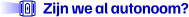
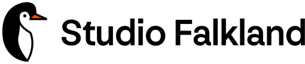
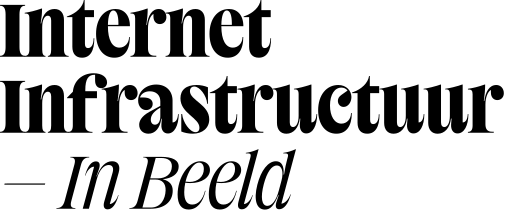
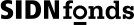

<br />

<p align="center">
<a href="https://zijnwealautonoom.nl">

</a>
</p>

<br />

Het internet raakt meer en meer gecentraliseerd bij enkele grote partijen. Voor een steeds digitaler Nederland kan die toenemende afhankelijkheid problematisch worden. Als die afhankelijkheid bijvoorbeeld tegen ons wordt gebruikt.

Zijn we al autonoom? maakt zichtbaar van welke partijen het internet in Nederland afhankelijk is en in welke sectoren die afhankelijkheid het grootst is.

Dit project is een resultaat van onderzoek van [Studio Falkland](https://falkland.studio), een ontwerpstudio uit
Eindhoven die werkt aan een vrijer en autonomer internet. De data is vergaard
uit openbare bronnen en publiek gemaakte datasets. De laatste update van de
data staat in de applicatie.

Het project is ontwikkeld als onderdeel van de call Internet Infrastructuur in Beeld van [SIDN Fonds](https://sidnfonds.nl). Hierin werken teams van ontwerpers samen met SIDN Labs aan visualisaties die de protocollen, infrastructuur en organisaties achter het internet in beeld brengen.

## Bronnen en meetmethodes

We werken met openbare data en publiek gemaakte datasets. Voor een acuteel
overzicht van gebruikte bronnen, raadpleeg onze
[bronnenpagina](https://zijnwealautonoom.nl/sources/).

## Open data

Dit project maakt gebruikt van open data. De verzamelde data wordt op dit punt
nog niet vrijgegeven totdat we zekerheid over de herbruikbaarheid kunnen
vaststellen. Wil je de data wel graag gebruiken? [Neem dan contact op met
Lei](https://zijnwealautonoom.nl/about/).

## Code
Deze repository bevat alle code voor Zijn we al autonoom?
```
├── app # De website als een statische NextJS applicatie
├── data # De datastructuren voor onze dataset
├── extraction # De code om data te verversen
```

Zijn we al autonoom is geschreven voor NodeJS. We raden gebruik van versie 24+
aan. Daarnaast gebruiken we de `pnpm` package manager.

### Extraction
Dit is een CLI die organsiaties updatet en vervolgens informatie verzamelt over
de infrastructuur waar deze organisatie van gebruikt maakt. Om deze te updaten,
run de volgende commando's:

```
pnpm install
pnpm extract
```

> [!NOTE]  
> Sommige extractie is gebaseerd op niet-openbare datasets in `data/sources`.
> Als je hier foutmeldingen over krijgt, overweeg om de taken die die data
> gebruiken uit te commenten.

### App
Om de app te draaien, moet je eerst data geextraheerd hebben. Run daarna:
```
pnpm app:dev
```

## Partners
<div class="grid" markdown>




</div>

## Licentie
Dit werk wordt openbaar gemaakt onder de EUPL-1.2 licentie. Zie de [LICENSE](./LICENSE.md) voor meer informatie.
